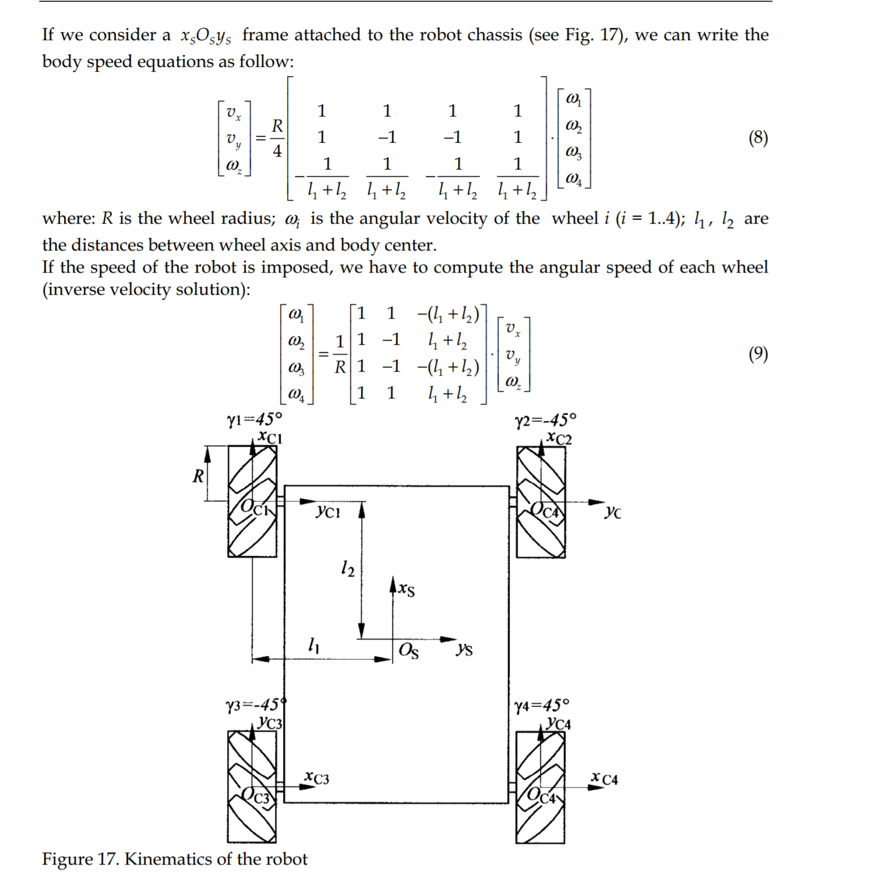
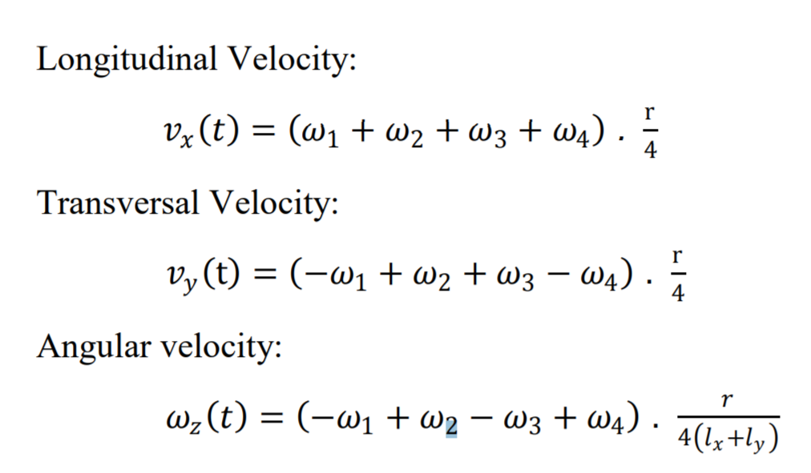

# Mecanum Wheel Test using Karnix FPGA board and IR remote control

## Configuration of the test setup

1. A cart is equipped with four mecanum (Ilon) wheels each can be driven independently using NEMA17 stepper motor (1.8 deg/step) and 1:30 reduction gear. Basic frequency of the stepper is 1000 Hz.

2. Each stepper motor is powered by DRV8825 IC driver which accepts **EN#**, **DIR** and **STEP** signals. All four DRV8825 are configured to divide step by 16 (MODE2 set to 1). Hence, a full circle wheel rotation takes 96000 steps (200 * 30 * 16).

3. All four motor drivers are connected to FPGA on [Karnix](https://github.com/Fabmicro-LLC/Karnix_ASB-254) board as follows:

 - gpio[6] for #Enable for ALL four drivers
 - gpio[7] for Forward Left motor DIR
 - gpio[9] for Forward Left motor STEP
 - gpio[10] for Forward Right motor DIR
 - gpio[11] for Forward Right motor STEP
 - gpio[12] for Backward Left motor DIR
 - gpio[13] for Backward Left motor STEP
 - gpio[14] for Backward Right motor DIR
 - gpio[15] for Backward Right motor STEP

4. An IR signal receiver (TSOP4838) is connected to gpio[3] of the board and is used to decode command from remote control.
 

## Recognized IR commands

IR decoder supports NEC based TV remote controls (Samsung TV and others). Those have 32 bit command word sent from control to device on every key press. The following commands are currently recognized:

 - 32'hFD020707 'Power OFF 1', 32'h19E60707 'Power OFF 2', 32'h97680707 'Enter' - Emergency STOP
 - 32'h9F600707 'Up' - move forward full circle 
 - 32'h9E610707 'Down' - move backward full circle 
 - 32'h9A650707 'Left' - strafe left full circle 
 - 32'h9D620707 'Right' - strafe right full circle 
 - 32'hD22D0707 'Exit' - Rotate Clockwise 
 - 32'h86790707 'Home' - Rotate Counter-Clockwise 

## GPIO/Key inputs

The following KEY inputs trigger commands:

 - key[0] - Move forward one full circle 
 - key[1] - Emergency STOP

## Mecanum Wheel Kinematics

